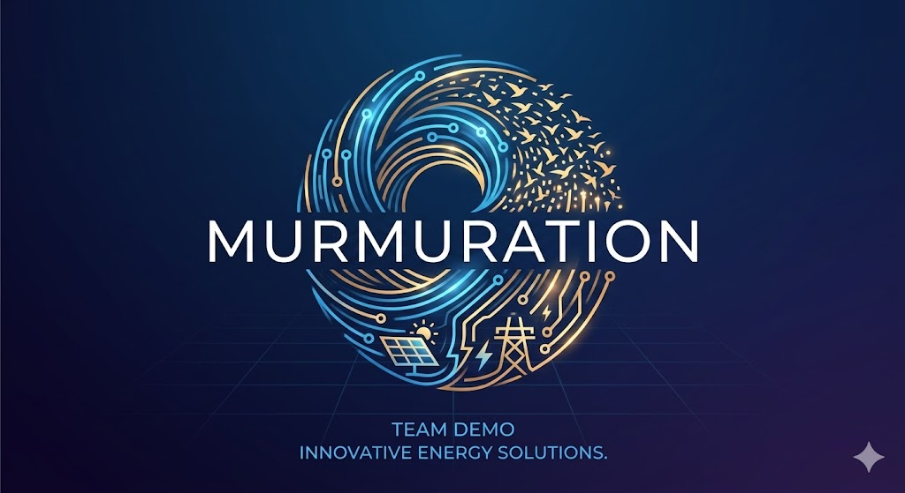
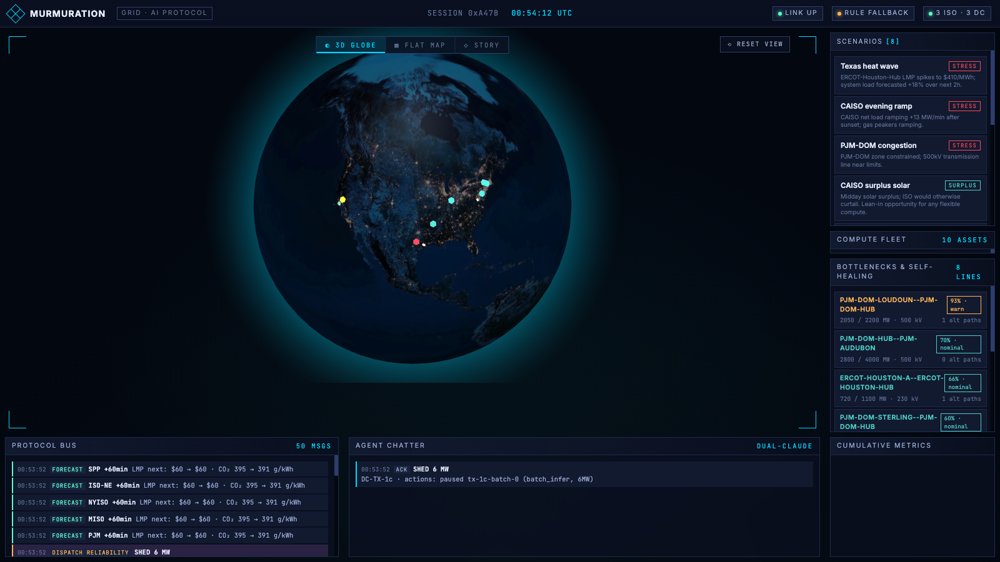
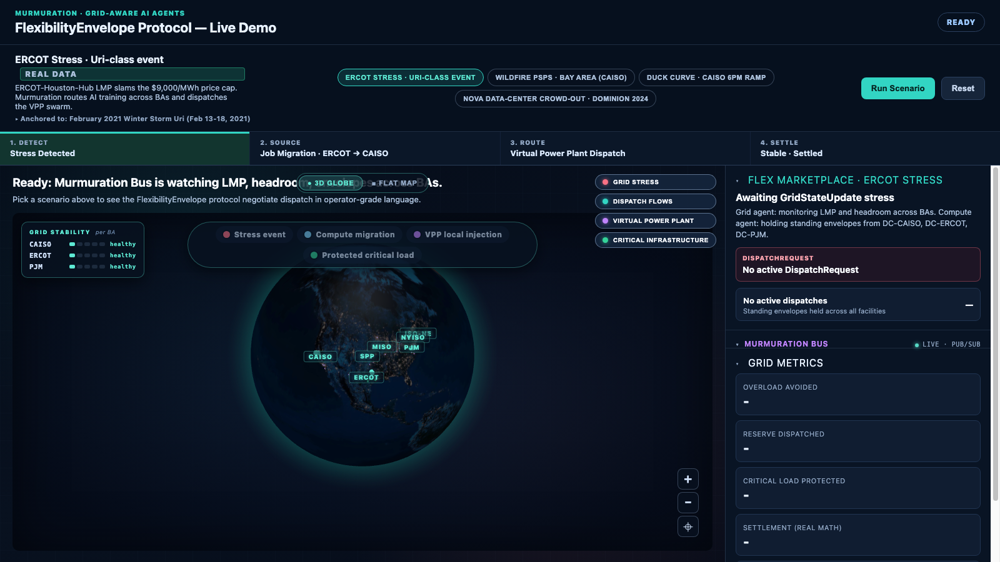

<p align="center">
  
</p>

# Murmuration

**The grid and the AI compute fleet need to start talking. We built the protocol — and the agents
that speak it.**

Built in one day at the **SCSP AI Hackathon · Electric Grid Optimization track · Washington DC ·
April 26, 2026**.

Data centers are becoming one of the largest — and most concentrated — loads on the US grid, right
as extreme weather makes the grid more fragile. Murmuration is a bilateral wire format that lets
grid operators and flexible loads negotiate in real time: the grid publishes state and dispatch
requests; data centers and home-battery fleets answer with standing flexibility envelopes, acks,
and counter-offers. Two live Python agents (Claude-backed, with rule-based fallback) speak the
protocol on each side, on top of load forecasting, anomaly detection, and a self-healing topology
layer.

<p align="center">
  
</p>

## Run it (no API keys required)

Everything below runs fully offline — live data sources and Claude narration are optional
enrichments via [`.env.example`](.env.example).

> **Unified mode:** the flagship server hosts all three apps from one URL —
> `/` is the live-agent system, `/replay/` serves the nictopia real-incident replay (committed
> static build, no Node needed at runtime), and the **⚖ Economics** tab drives the
> agentic_workflow prototype's hard-bid job scheduler through `/api/backtest/*` endpoints.
> Start it with the flagship quick start below and everything is reachable from one place.
> The replay bundle is regenerated with `scripts/build_replay.sh` after any nictopia change.

### 1. `murmuration/` — the flagship (Python)

The end-to-end system demoed on stage: protocol bus with 12 Pydantic message types, GridAgent +
ComputeAgent, 9 data centers + a 100-home virtual power plant, GBM load forecaster, z-score
anomaly detector, networkx topology healer, tiered workload router, 9 scenarios, and a 3-tab UI
(3D globe · flat map · story walkthrough) over FastAPI + WebSocket.

```bash
cd murmuration
python3 -m venv .venv          # Python 3.12+
.venv/bin/pip install -r requirements.txt
./run.sh
# open http://127.0.0.1:8765 — pick a scenario in the right rail (e.g. "Texas heat wave")
```

See [`murmuration/README.md`](murmuration/README.md) for scenarios, endpoints, troubleshooting.

### 2. `nictopia/` — the visual demo (React)

A standalone globe + flat-map replay of real archived grid incidents (Winter Storm Uri, the 2019
CAISO PSPS, the duck curve, Hurricane Helene) with primary-source citations and formula-derived
dollar/carbon figures. All data ships as committed JSON caches — no backend.

```bash
cd nictopia
npm install
npm run dev
# open http://localhost:5173
```

<p align="center">
  
</p>

### 3. `agentic_workflow/` — the original prototype (Python)

Where it started: two Claude agents negotiating GPU-job placement over a synthetic 14-day,
4-zone grid replay with hard-bid economics (every job has a max willingness-to-pay; rejection is
a correct outcome). Includes a reproducible merit-order data generator with day-ahead vs real-time
prices and forecast-bust modeling.

```bash
cd agentic_workflow
python3 -m venv .venv && .venv/bin/pip install pandas numpy pyarrow anthropic python-dotenv
.venv/bin/python generate_grid.py   # writes data/*.parquet — no API needed
.venv/bin/python gridcache.py       # data-layer smoke test — no API needed
# .venv/bin/python runner.py        # full agent replay — needs ANTHROPIC_API_KEY, ~$2-4
```

## How the pieces relate

The team built in parallel and merged deliberately: Rohan's `agentic_workflow/` prototype proved
the two-agent negotiation loop; a Copilot-built mock and Nick's `nictopia/` explored how to make
it legible to judges; Shashank's `murmuration/` package unified the ideas into the live protocol
system we staged. The written comparison that drove the final call is in
[`docs/reference/shashank_branch_review.md`](docs/reference/shashank_branch_review.md).

## Repo map

| Path | What it is |
|---|---|
| `murmuration/` | Flagship: protocol + agents + forecasting + topology healer + 3-tab UI |
| `nictopia/` | React globe/flat-map demo over real archived incidents |
| `agentic_workflow/` | Original two-agent prototype with hard-bid job economics |
| `MURMURATION.md` | Pre-build design doc (historical) |
| `PITCH.md` | Pitch-deck rationale |
| `docs/demo/` | Stage materials: 4-slide deck, demo script, judge Q&A prep, presenter card |
| `docs/reference/` | Grid-physics honesty notes, implementation comparison, nictopia design |

## Data honesty

- CAISO data is fetched live (via `gridstatus`) when the network allows; ERCOT/PJM/MISO/NYISO/
  ISO-NE/SPP use EIA-930 (optional key) and everything degrades to calibrated synthetic data.
- nictopia's incident replays are anchored to dated, committed snapshots with FERC/NERC/utility
  source URLs in each JSON.
- HIFLD transmission-line/substation overlays for the flagship flat map require a bulk download
  (paths in `murmuration/README.md`); without them the map simply omits those layers.
- The UIs load three.js/globe.gl/Reveal.js from public CDNs, so the browser needs internet even
  though the backends run offline.

## Team

- **Nick Allison** ([@enturesting](https://github.com/enturesting)) — nictopia globe demo,
  real-incident data anchoring, demo narrative + pitch materials, integration
- **Teddy Allison** — scenario decisioning, deep research and design thinking,
  real-incident data anchoring, demo narrative
- **Rohan Dani** ([@RohanDani2](https://github.com/RohanDani2)) — `agentic_workflow/` prototype:
  synthetic grid generator, hard-bid compute-agent economics
- **Shashank Chikara** — flagship `murmuration/` package: protocol layer, live agents, anomaly
  detector, topology healer, 3-tab UI
