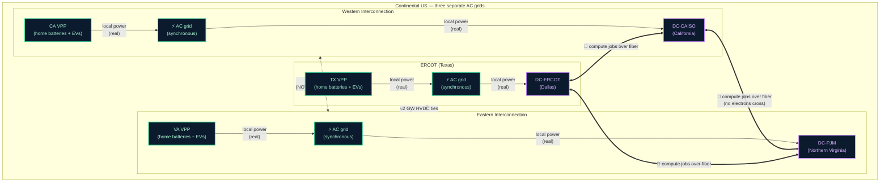

# What can travel between regions of the US grid (and what can't)

A reference doc to keep our visualization honest and inoculate the team against the "grid expert in the audience" problem.

## TL;DR

Continental US is **three separate AC grids** that are barely connected. **Electricity does NOT meaningfully flow** between California, Texas, and the Eastern US in real time. Total HVDC ties between the three interconnections: **~2 GW continent-wide** — vanishingly small relative to the ~700 GW of US peak demand.

So when our viz shows an arc between DC-CAISO and DC-ERCOT labeled "850 MW," it must NOT mean electrons. It means **compute workload migrating over fiber** — Google's Carbon-Intelligent Computing does this for real every day. The DC in Texas throttles down (uses less Texas grid power); the DC in California ramps up (uses more California grid power). No electrons cross — only jobs.

VPP arcs (home batteries, EVs, smart thermostats) are **always local** to their own grid. CA homes serve CAISO; TX homes serve ERCOT. They cannot send power across interconnection boundaries.

---

## The diagram

**Reading the diagram**:
- 🟢 **Solid green arrows** = real electrical power, flows only within one interconnection.
- 🟣 **Bold double-headed lines** = compute workload (jobs/data) over fiber. Crosses regions freely. **No electricity crosses.**
- ⚪ **Dotted lines between regions** = the actual HVDC ties that DO move some electricity between interconnections — but at ~2 GW total, they're a footnote, not a highway.

---

## What CAN travel between regions

| Channel | Capacity | What moves | Used by Murmuration? |
|---|---|---|---|
| **Compute workload over fiber/WAN** | Effectively unlimited (terabit fiber backbones) | Training jobs, inference batches, queue migration | ✅ **YES — primary cross-region channel** |
| **Wholesale market signals + telemetry** | Negligible bandwidth | LMP, fuel mix, dispatch requests, envelope handshakes | ✅ **YES — the protocol bus** |
| **HVDC ties** (Eastern↔Western, Eastern↔ERCOT) | ~2 GW continent-wide total. Examples: Pacific DC Intertie 3.1 GW (within Western), Lamar HVDC 210 MW (East↔ERCOT), Eagle Pass back-to-back 36 MW | Bulk electrical power | ⚠️ Not directly modeled in our viz — too small to matter for the demo |
| **Synchronized AC transmission** within an interconnection | Up to GW-scale | Bulk electrical power | ✅ Implicit — DCs use their local grid; VPPs serve their local grid |

## What CANNOT travel between regions

- **Real-time AC power transfer at meaningful scale** between Eastern, Western, and ERCOT. The grids run at slightly different frequencies and phases — they aren't synchronously linked. To send 850 MW of electricity from CA to TX in real time, you'd need ~425× more HVDC tie capacity than exists today.
- **VPP dispatch from one grid to another.** A home battery in San Francisco cannot send watts to a hospital in Houston. It can only discharge to the local CAISO grid.
- **Synchronized inertial response** across grids. Frequency excursions are local.

---

## What Murmuration actually moves

Three streams, all of which are real and physically possible:

1. **Compute workload (cross-region, mediated by global schedulers)** — when ERCOT is stressed, the data center in Dallas **throttles down**: it stops accepting new training jobs and pauses some running ones at their next checkpoint. The global scheduler **reroutes new jobs to California instead**. Net effect: TX grid sees less DC load; CA grid sees more. This is what Google, Microsoft, and Meta already do ("Carbon-Intelligent Computing"). The fiber underneath carries scheduling decisions and (occasionally) checkpoint state — see "How does compute migration actually happen?" below.

2. **Local VPP dispatch (within each interconnection)** — when ERCOT needs help, the *Texas* virtual power plant (50K Texas homes) discharges into the local Texas grid. That local relief frees ERCOT capacity, which then enables cross-region compute migration without rolling blackouts.

3. **Protocol bus signals (cross-region, over the internet)** — `GridStateUpdate`, `FlexibilityEnvelope`, `DispatchRequest`, `TelemetryFrame`. These are tiny JSON messages. They move freely. Bandwidth is irrelevant; the value is in the *coordination*.

**The mental model**: Murmuration is **air traffic control for compute and flexibility**. It tells data centers WHEN to turn down (or up) based on each grid's local stress. The electricity stays local. The intelligence travels.

---

## How does compute migration actually happen? (the mechanism, in three flavors)

When you say "850 MW load shifted from ERCOT to CAISO," there are three different things that might literally be happening under the hood. Knowing which one matters for credibility with grid-savvy listeners.

### A. Throttle + reroute via global scheduler (the most common — ~90% of cases)

What actually happens:
- DC-A receives the stress signal.
- DC-A's scheduler **stops admitting new jobs** of the deferrable classes (training, batch inference, video encoding).
- DC-A **pauses some running jobs at their next checkpoint** (typical training run checkpoints every 10-30 min).
- A global scheduler (Google's Borg, Meta's Twine, Azure scheduler) **routes new jobs from the global queue to DC-B instead of DC-A**.
- The paused jobs in DC-A wait dormant, OR they're picked up by DC-B from shared storage.
- Net result: DC-A's MW demand drops, DC-B's rises.

**What's on the fiber**: scheduling decisions + queue metadata (a few KB). Not the running jobs.

### B. Checkpoint + resume across regions (the "real" job migration)

For a longer-deferred or critical job:
- DC-A pauses the job at next checkpoint → checkpoint file (~50-500 GB) saved to shared storage.
- If the storage is already geo-replicated (typical at hyperscaler scale), the checkpoint file is already accessible from DC-B — no extra fiber transfer needed.
- DC-B reads the checkpoint and resumes the same training job.

**What's on the fiber**: maybe a checkpoint file (if storage isn't already replicated), maybe nothing.

### C. Live process migration (very rare, mostly hypothetical for our use case)

- VMware vMotion, Google's live VM migration. The actual running process state is genuinely streamed over the network.
- For VMs serving stateless workloads: doable.
- For multi-GPU training jobs: technically possible, practically not done — state is huge, both DCs hold the resources during transit, costly.

**What's on the fiber**: the full process state, GB-scale, streamed live.

### Summary table

| Mechanism | Frequency in real world | What's on the fiber | Best fit |
|---|---|---|---|
| **Throttle + reroute via scheduler** | ~90% | Scheduling decisions (KB) | New incoming jobs, batch queues, training queues |
| **Checkpoint + resume** | ~10% | Checkpoint file or nothing (if geo-replicated) | Long-running training jobs being moved across regions |
| **Live migration** | <1% | Full process state (GB) | Stateless VMs (rarely the GPU workloads we care about) |

### What this means for our pitch

The **honest, defensible story** for the demo is mechanism A:

> "When ERCOT is stressed, the Texas data center throttles down — it stops accepting new training jobs and pauses some running ones at their next checkpoint. The global scheduler routes new jobs to California instead. Net result: 850 MW of demand shifts from one grid to the other. The fiber carries scheduling decisions, not the jobs themselves."

That's both more accurate AND more credible than saying "850 MW of compute is streaming over fiber." It positions the data center as a **dispatchable load** (the actual claim of the protocol) rather than as some sci-fi "GPU state over WAN" thing.

### Talking-point answers

**"Wait, you can't really stream 850 MW of compute over fiber, can you?"**
> "Correct — and we don't claim to. The fiber carries scheduling decisions. The data center in Texas throttles its job intake; the scheduler routes new jobs to California instead. Some long-running training jobs may pause at a checkpoint and resume in California, but most of the time it's just the scheduler shifting the queue. The 850 MW is the resulting *grid demand shift*, not the data on the wire."

**"Isn't that just demand response?"**
> "Demand response is one mechanism the protocol supports — but DR is usually a 1-hour-ahead notice with a 1-hour event window. Murmuration's protocol works at three time scales: sub-second contingency response (pre-authorized envelope drops), 5-minute envelope-based dispatch, and multi-hour scheduling. The throttle-and-reroute pattern works at all three. DR is the slowest of the three; the fast paths are what unlock the protocol's unique value."

---

## "Why is compute migration measured in MW? Aren't MW for electricity?"

**Short answer**: yes, MW is an electrical-power unit. We use it because **MW is what changes on each grid**, not because data is electricity.

### The two things being moved are very different sizes

| What's actually moving | Quantity | Unit |
|---|---|---|
| The job data itself (model checkpoints, queue state, container images) over fiber | ~MB to ~GB | gigabytes |
| The **electrical power demand** that those jobs cause when they run | **~MW to ~GW** | **megawatts** |

When we label a migration arc "850 MW · COMPUTE (fiber)," we're describing the **power-demand shift between grids**, not the data being moved. The actual data on the fiber is tiny.

### Worked example

A training job for a frontier model:
- **Job state on the wire**: ~50 GB of model weights + checkpoint metadata. Moves over fiber in a minute or two.
- **Power draw while running**: ~50 MW of GPUs (a few hundred H100s + cooling).
- **Migration**: ERCOT pauses 17 of these jobs, CAISO resumes them. **50 GB × 17 = 850 GB of data over fiber. ERCOT's grid demand drops 850 MW. CAISO's grid demand rises 850 MW.**

So "850 MW · COMPUTE (fiber)" should be read as:
> "The fiber moves a few hundred GB of job state. The *consequence* on the two grids is an 850 MW shift in power demand — ERCOT is relieved by 850 MW, CAISO absorbs 850 MW."

The MW number is the **grid-impact unit**, not the data unit. We use it because grid operators think in MW, and MW is what matters for "is the grid stressed?"

### Quick analogy

Think of a factory shift change. If you move 1,000 workers from a Texas factory to a California factory:
- The **workers themselves** travel by bus (small, fast, bandwidth-irrelevant).
- The **factory's power meter** in Texas drops because no one's running the machines there. The California factory's meter rises because they're running them now.
- You'd describe the change as "the load moved from Texas to California" — and you'd measure it in megawatts of factory load, not in passenger-miles of bus travel.

That's exactly what compute migration looks like. The jobs are the "workers." Fiber is the "bus." The MW is the load that lights up at the new location and goes dark at the old one.

### Why we kept "MW" in the label (instead of "GB" or "jobs/min")

- Grid operators speak MW. Pitching to ISOs/utilities, MW is the lingua franca.
- The MW number is the *thing the protocol is optimizing for*. We don't care how many GB Google moves; we care how much grid stress we relieve.
- Saying "850 MW shifted" makes it directly comparable to other grid actions ("instead of firing an 850 MW peaker, we shifted 850 MW of compute load to a calmer grid").

### Optional viz fix

If "850 MW · COMPUTE (fiber)" still reads as "850 MW of electricity over fiber" to a viewer, change the inline label to one of:
- **"850 MW LOAD SHIFT · jobs over fiber"** — clearer that the MW is a load-shift, not a transfer
- **"850 MW grid relief · compute migrated to CA"** — emphasizes the grid impact
- **"850 MW (load moved off ERCOT) · jobs over fiber"** — most explicit

These cost a few extra characters but eliminate the question.

---

## Implications for our visualization

| Current arc | What it should mean | Label fix |
|---|---|---|
| DC-ERCOT ↔ DC-CAISO at "850 MW" | 850 MW of compute load shifts off ERCOT and onto CAISO via job migration | "850 MW · COMPUTE MIGRATION (fiber)" — distinct stroke + 📡 glyph |
| 36 VPP dots → DC-ERCOT (current viz) | ❌ **WRONG** — implies CA/NY/etc homes send power to TX | Relocalize: each VPP dot connects only to the DC in its own interconnection. CA dots → DC-CAISO; PJM dots → DC-PJM; TX dots → DC-ERCOT |
| DC-ERCOT → critical sites (TX hospitals) | TX grid (with DC + VPP relief) keeps TX hospitals online | OK as-is — these are local |

**Persistent legend hint** (small text below the map): *"Cross-region arcs = compute jobs (fiber). Local arcs = electrical power. The 3 US interconnections are not synchronously linked."*

---

## Honest caveats (anti-overclaim)

- **HVDC ties exist and are growing.** Projects like the proposed SunZia, TransWest Express, and Grain Belt Express are real. Long-term, the inter-interconnection capacity will be larger. Today though, ~2 GW total is the right order of magnitude for the demo.
- **Within an interconnection, long-distance transfer is real but lossy.** PJM moves power across multiple states; CAISO imports from the Pacific Northwest via the Pacific DC Intertie (3.1 GW). When we say "CAISO grid (local)" in the diagram, "local" means "within the Western Interconnection," which spans 11 western states + parts of Mexico and Canada — not just California.
- **Compute migration has limits.** Latency-bound workloads (real-time inference, customer-facing serving) cannot migrate. Murmuration's protocol explicitly carries `workload_class` (training / batch_infer / online_serve / fine_tune / embedding) so only the flexible classes are moved. The brainstorm doc §5.1 has the full table.
- **Data-locality + sovereignty constraints.** EU data can't be processed in US East. Sovereign workloads stay put. Our protocol carries `data_locality_constraints` per envelope.

---

## Sources

- [NERC Reliability Standards & Interconnection Maps](https://www.nerc.com/) — the 3-interconnection model
- [DOE Quadrennial Energy Review](https://www.energy.gov/policy/quadrennial-energy-review-qer) — HVDC tie capacity figures
- [EIA Today in Energy: U.S. electric power grid](https://www.eia.gov/todayinenergy/) — grid topology references
- [Google Carbon-Intelligent Computing (blog)](https://cloud.google.com/blog/topics/sustainability/google-carbon-intelligent-compute) — real-world precedent for compute migration
- [Pacific DC Intertie (Wikipedia overview, links to BPA primary docs)](https://en.wikipedia.org/wiki/Pacific_DC_Intertie) — example of large within-interconnection HVDC line
- [WECC, MISO, ERCOT, PJM, ISO-NE, NYISO, CAISO operating maps](https://www.eia.gov/electricity/gridmonitor/) — EIA grid monitor

---

## TL;DR for the demo presenter

> "Three things travel cross-region in our system: **the protocol bus signals** (tiny JSON), **the compute workload** (jobs over fiber, no electrons), and **the agent reasoning** (Claude on each side). Electricity stays local — TX homes serve TX, CA homes serve CA. That's not a constraint we're working around; that's how we keep the demo physically honest."

---

## Key terms (always gloss these inline when they appear in UI or pitch text)

- **Interconnection** — one of the 3 large synchronous AC grids that make up continental US power: Eastern, Western, and ERCOT (Texas).
- **HVDC tie** — High-Voltage Direct Current line that converts AC→DC→AC to bridge two interconnections that aren't synchronously linked. Total continent-wide tie capacity ≈ 2 GW.
- **Duck curve** — CAISO net-load shape: solar floods the grid midday (the "belly"), then drops at sunset just as demand peaks (the "neck"). The shape looks like a duck. Forces gas peakers to ramp hard at 6pm. Worse every year as more solar is installed.
- **LMP** (Locational Marginal Price) — wholesale electricity price at a specific grid node, $/MWh. The grid-side signal that "price is high = stress."
- **BA** (Balancing Authority) — the entity that matches supply and demand in a region (e.g., CAISO is California's BA).
- **VPP** (Virtual Power Plant) — many small distributed energy resources (home batteries, EVs, smart thermostats) coordinated to act as one dispatchable resource.
- **PSPS** (Public Safety Power Shutoff) — utility de-energizes lines during high wildfire risk to prevent ignition. PG&E does this in CA.
- **FlexibilityEnvelope** — Murmuration protocol message: a standing offer from a compute facility saying "I can shed X MW for Y minutes at $Z/MWh, no per-event approval needed." Refreshed every 5 minutes.
- **Curtailment** — forced reduction of renewable generation due to oversupply or transmission limits. CAISO curtailed 3.4M MWh of solar+wind in 2024.
- **Compute migration** — shifting workload (training jobs, batch inference) between data centers in different regions over fiber/WAN. Real, common practice. NOT electron transfer.
