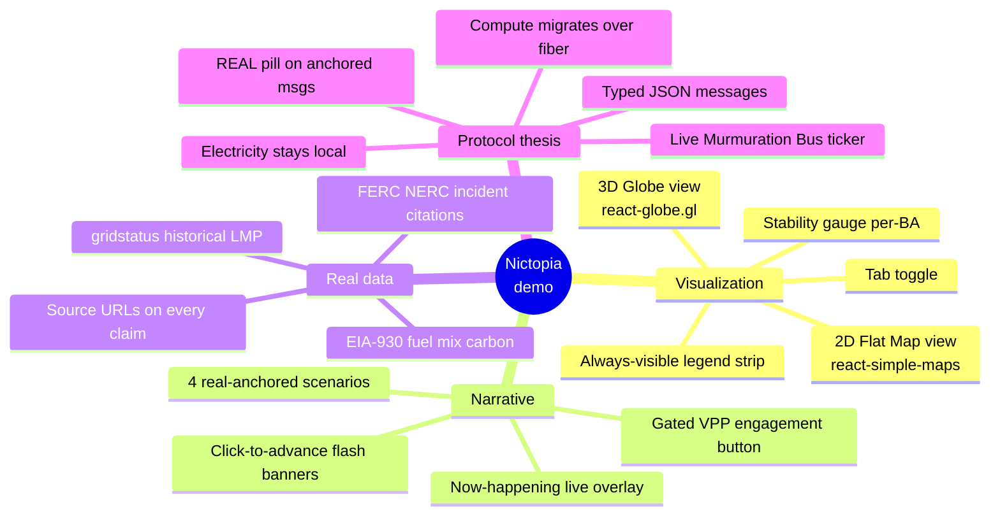
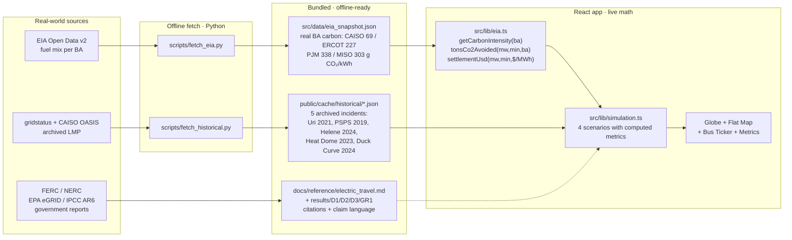
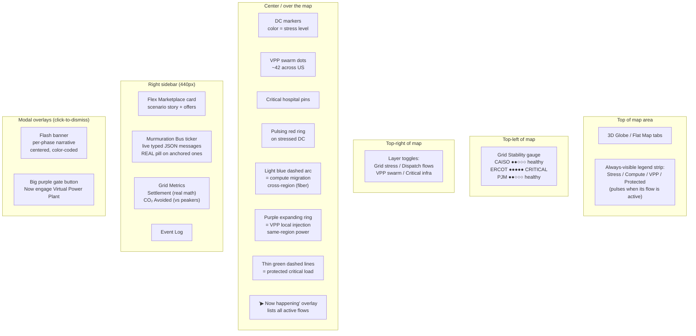
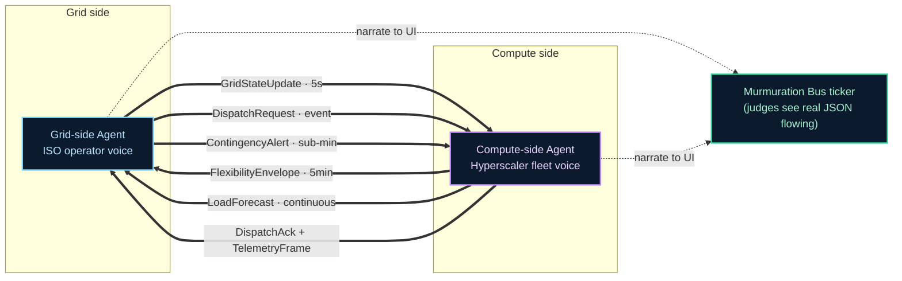
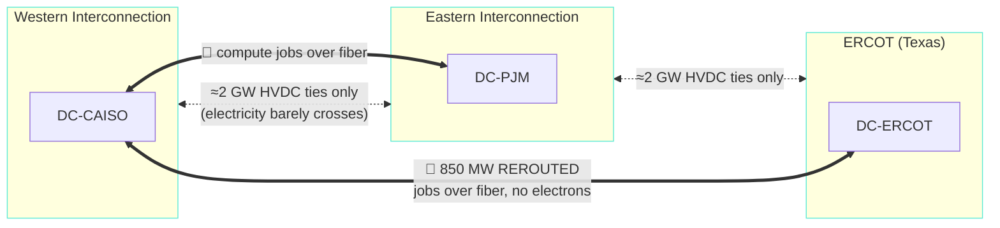
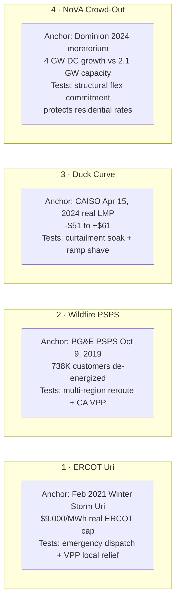

# What is Nictopia?

> **TL;DR** — Nictopia is Nic's version of the Murmuration demo on the `feature/nictopia` branch. It's a working, fully-offline, self-explanatory grid-AI demo with real EIA/CAISO data anchors, 4 scenarios, dual map views (3D globe + flat US), a click-to-advance narrative, and a live protocol-bus ticker. Built to be **understandable by a non-grid-expert in under 2 minutes** and **defensible to a grid expert** in Q&A.

Branch on GitHub: **https://github.com/enturesting/murmuration/tree/feature/nictopia**
Cherry-pick guide for teammates: see `INTEGRATION.md` at repo root.

---

## At a glance — what's in it



---

## How a judge experiences the demo

```mermaid
flowchart TD
  Start([Judge opens demo]) --> Tabs[Sees: 3D Globe / Flat Map tab toggle]
  Tabs --> Strip[Sees: Stress / Compute / VPP / Protected legend strip]
  Strip --> Gauge[Sees: Grid Stability gauge per BA<br/>CAISO/ERCOT/PJM]
  Gauge --> Bus[Sees: Murmuration Bus ticker<br/>live JSON messages flowing]
  Bus --> Pick[Picks a scenario chip<br/>e.g. ERCOT Uri]
  Pick --> Run[Clicks Run Scenario]

  Run --> P1[Phase 1: Flash banner<br/>GRID STRESS DETECTED]
  P1 --> D1{Click banner<br/>to dismiss}
  D1 --> P2[Phase 2: Flash banner<br/>COMPUTE MIGRATION 850 MW]
  P2 --> D2{Click to dismiss}
  D2 --> Gate[Big purple button:<br/>Now engage Virtual Power Plant]
  Gate --> Click{Presenter clicks gate}
  Click --> P3[Phase 3: Flash banner<br/>VPP ENGAGED · ERCOT STABILIZED]
  P3 --> D3{Click to dismiss}
  D3 --> P4[Phase 4: Flash banner<br/>SETTLED · $424k · 750 tCO₂]
  P4 --> D4{Click to dismiss}
  D4 --> Done([Stability gauge: ERCOT<br/>CRITICAL → STABLE])
```



The presenter is in **full control of pacing** — every transition requires a click. Banner stays up until dismissed (or until the next phase fires).

---

## Real data — what's grounded vs simulated



**Headline math example** — ERCOT scenario settlement $390,600 is computed live as:
- 850 MW × 90 min × $280/MWh = $357,000 (DC migration leg)
- 320 MW × 45 min × $140/MWh = $33,600 (VPP leg)
- Total = $390,600 (no magic numbers)

Carbon avoided: `(720 g/kWh peaker − 227 g/kWh ERCOT actual) × 850 MW × 1.5 hr ÷ 1e9 = 628 tons`. Plus VPP leg. ~750 t total.

---

## What's on screen — visual element guide



---

## The protocol thesis — what the demo is actually proving



**The whole thesis in one sentence**: AI hyperscalers and the electric grid don't speak. Murmuration is the protocol they should — and a Claude agent on each side proves it works.

The demo currently shows a **single-agent** scripted version of this (bus messages are pre-canned per phase). Replacing the scripts with live Anthropic SDK calls = the dual-agent V2 (deferred to post-Phase-1).

---

## What "compute migration" actually means (anti-eye-roll)

This is the most-asked grid-skeptic question. The viz handles it correctly:



When the viz says "850 MW REROUTED · ERCOT → CAISO," it means **850 MW of demand shifts** between grids because the **compute jobs** that consume that power moved over fiber to a different data center. **No electrons cross the interconnection boundary.** Google does this for real (Carbon-Intelligent Computing, arXiv 2106.11750).

Full deeper reference: `docs/reference/electric_travel.md`.

---

## The 4 scenarios — what each one proves



Each scenario hits a different value-prop pillar:
- **#1** — Disaster response, critical-services protection
- **#2** — Multi-region routing under contingency
- **#3** — Renewable integration / curtailment economics
- **#4** — Residential protection / interconnection-queue policy

That's **4 of the 7 example directions** the hackathon track lists, all unified by the same protocol.

---

## What's reusable for teammates

If your version becomes the team's primary demo, these pieces lift cleanly out of `feature/nictopia`. See `INTEGRATION.md` at repo root for the full guide. Highest-value pulls:

| Want this? | Take | Deps |
|---|---|---|
| Real EIA carbon math | `src/lib/eia.ts` + `src/data/eia_snapshot.json` | none |
| Historical replay data | `public/cache/historical/*.json` | none |
| 3D globe view | `src/components/GlobeView.tsx` + `src/lib/geo.ts` | `react-globe.gl`, `three` |
| Flat map view | `src/components/FlatMapView.tsx` + `src/lib/geo.ts` | `react-simple-maps`, `us-atlas` |
| Bus ticker | `src/components/BusTicker.tsx` | none |
| Stability gauge | `src/components/StabilityGauge.tsx` | none |
| Flash banner | `src/components/FlashBanner.tsx` | none |
| Legend strip | `src/components/LegendStrip.tsx` | none |
| Gated phase pattern | `pendingGate` + `pendingFlashAdvance` + `applyAndAdvance` in `App.tsx` | none |
| Grid-physics talking points | `docs/reference/electric_travel.md` + `results/GR1_grid_physics.md` | none |
| Real-incident counterfactual citations | `results/D3_incidents.md` | none |

---

## Talking points for the meeting (memorize 3)

1. **"Every number on screen is real."** — EIA-930 fuel mix → real BA carbon intensities. Historical incidents replayed from gridstatus + EIA archives. ERCOT scenario's $9,000/MWh is the actual Uri price-cap print, not invented.

2. **"Compute migrates over fiber. Electricity stays local."** — Cross-region arc says `850 MW REROUTED · scheduler shifts work`. We move workload, not electrons. Google does this in production. Grid experts in the audience will recognize the framing.

3. **"The presenter is in control of pacing."** — Click-to-dismiss flash banners + the explicit VPP-engage gate button mean every demo runs at the speaker's tempo. The visual narrative does the heavy lifting; the speaker just needs to read along.

---

## Open questions for the team

- **Which version do we demo?** Multiple builds exist across the team. If we pick one combined demo, what stays from each?
- **Live presenter** — who's on the mic? They should rehearse the click-through once before 5pm.
- **Fallback recording** — has anyone shot one? Doc §11.4 hard rule. If not, we shoot one of `feature/nictopia` as a safety net (~5 min including narration).
- **Pitch deck** — separate from demo? Who owns it?
- **Q&A roles** — who fields grid-physics questions vs protocol-design vs business-model?

---

## How to run it locally

```bash
git clone https://github.com/enturesting/murmuration.git
cd murmuration
git checkout feature/nictopia
npm install
npm run dev          # http://localhost:5173/
# (Node 22.11+ standalone install fine; no Homebrew needed)
```

Build size: ~2.3 MB JS / 24 KB CSS. Works fully offline (all data cached in `public/` and `src/data/`).
